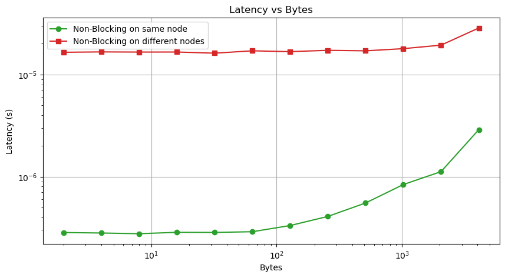

# Project 3: MPI Ping-Pong and Ring Shift

## Part 1: Blocking Ping-Pong

The code for Blocking Ping Pong ([Here](./PingPong.cpp))

## Part 2: Non-block Ping-Pong

The code for Non-Blocking Ping Pong ([Here](./NonBlockPingPong.cpp))

## Part 3: MPI Ring Shift

## Part 4: Non-blocking MPI Ring Shift

