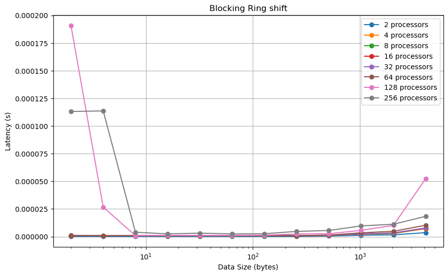

# Project 3: MPI Ping-Pong and Ring Shift

## Part 1: Blocking Ping-Pong

The code for Blocking Ping Pong can be found [here](./PingPong.cpp)

**Latency**: It refers to the time delay experienced when sending a single data packe between two processing units:

$$Latency\ (s) = \frac{Run\ time\ (s)}{Number\ of\ iterations}$$
 
**Bandwidth**: It refers to the maximum rate of data transfer between two processing units. It represents the amount of data that can be transmitted per unit of time.

$$Bandwidth\ (bps) = \frac{Transfered\ data\ (Byte)}{Run\ time\ (s) \times Number\ of\ iterations}$$

The latency appears to increase as the size of the message being transferred increases for both cases. The runtime for the different node case is significantly higher compared to the same node case. This is because of the overhead of transferring messages between nodes when communication happens across different nodes.

The bandwidth appears to increase as the size of the message being transferred increases for both same-node and different-node communication. It is evident that in the same-node scenario, the bandwidth is much higher than in different-node communication.

## Part 2: Non-block Ping-Pong

The code for Non-Blocking Ping Pong can be found [here](./NonBlockPingPong.cpp)

The trend of latency and bandwidth for non-blocking communication is completely similar to blocking ping pong. There is lower latency and higher bandwidth when the data communication is happening within the same node.

In comparison of the results from Part 1 (which are presented in the figures below) the following conclusions can be made:

- Blocking communication incurs higher latency, as the sender or receiver may be busy. Nonblocking communication may overlap communication with computation, potentially reducing overall latency.
- Same-node communication will generally maintain lower latency and higher bandwidth compared to different-node communication. However, as the size of data increases, the differences in latency and bandwidth tend to decrease.
- The significance of whether the effect occurs intra-node or inter-node is higher than the impact of changing communication types (blocking/non-blocking).

## Part 3: MPI Ring Shift

## Part 4: Non-blocking MPI Ring Shift

