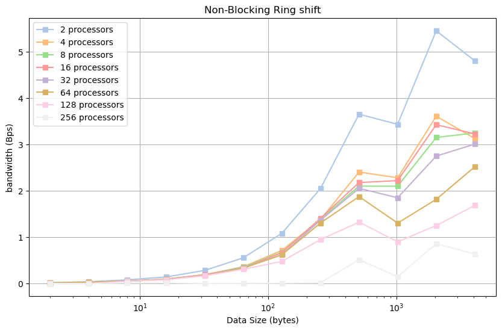

# Project 3: MPI Ping-Pong and Ring Shift

## Part 1: Blocking Ping-Pong

The code for Blocking Ping Pong can be found [here](./PingPong.cpp)

**Latency**: It refers to the time delay experienced when sending a single data packe between two processing units:

$$Latency\ (s) = \frac{Run\ time\ (s)}{Number\ of\ iterations}$$
 
**Bandwidth**: It refers to the maximum rate of data transfer between two processing units. It represents the amount of data that can be transmitted per unit of time.

$$Bandwidth\ (bps) = \frac{Transfered\ data\ (Byte)}{Run\ time\ (s) \times Number\ of\ iterations}$$

The latency appears to increase as the size of the message being transferred increases for both cases. The runtime for the different node case is significantly higher compared to the same node case. This is because of the overhead of transferring messages between nodes when communication happens across different nodes.

The bandwidth appears to increase as the size of the message being transferred increases for both same-node and different-node communication. It is evident that in the same-node scenario, the bandwidth is much higher than in different-node communication.

## Part 2: Non-block Ping-Pong

The code for Non-Blocking Ping Pong can be found [here](./NonBlockPingPong.cpp)

The trend of latency and bandwidth for non-blocking communication is completely similar to blocking ping pong. There is lower latency and higher bandwidth when the data communication is happening within the same node.

In comparison of the results from Part 1 (which are presented in the figures below) the following conclusions can be made:

- Blocking communication incurs higher latency, as the sender or receiver may be busy. Nonblocking communication may overlap communication with computation, potentially reducing overall latency.
- Same-node communication will generally maintain lower latency and higher bandwidth compared to different-node communication. However, as the size of data increases, the differences in latency and bandwidth tend to decrease.
- The significance of whether the effect occurs intra-node or inter-node is higher than the impact of changing communication types (blocking/non-blocking).

## Part 3: MPI Ring Shift

The code for Blocking Ring Shift can be found [here](./MPIringshift.cpp)

 The figure above shows the latency for different processor and message sizes for the blocking case. 
 

The figure above shows the bandwidth across different process sizes and message sizes for the blocking case. For all processes, bandwidth monotonically increases as the message size increases.

For `amd-20` which the cluster we used have a restriction of 128 cores per node, which means that the 256 processes cannot be accommodated on a single node. Consequently, this setup exhibits the lowest bandwidth and highest latency. Notably, the scenario involving only two processes demonstrates the highest bandwidth, as these processors reside within the same socket.Surprisingly, the latency of off-node communication is remarkably close to that of on-node communication in the nonblocking case, indicating the efficiency of the network. 

## Part 4: Non-blocking MPI Ring Shift

The code for Non-Blocking Ring Shift can be found [here](./NonBlockringshift.cpp)

When utilizing 256 cores spread across two nodes, latency increases significantly compared to executing processes on a single node. This is primarily attributed to the delay incurred by inter-node communication, contrasting with the swift memory access within a single node. While the latency remains relatively stable for on-node and off-node communications in the blocking scenario, non-blocking off-node communication exhibits notably higher latency. This is because non-blocking communication necessitates confirmation of message reception, contrasting with the straightforward function call in blocking communication. Consequently, the bandwidth observed in blocking communication surpasses that of non-blocking communication due to the additional overhead involved.

In the figures below, results for Blocking and Non-blocking Ring Shift operations have been compared.

